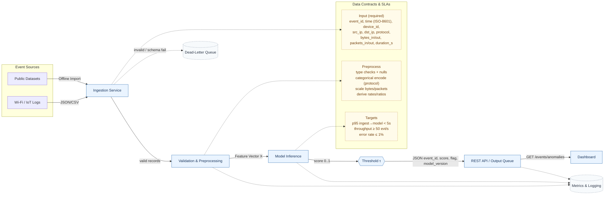

```mermaid
---
config:
  layout: dagre
---
flowchart LR
 subgraph Source["Event Sources"]
        A1["Wi-Fi / IoT Logs"]
        A2["Public Datasets"]
  end
 subgraph Contracts["Data Contracts & SLAs"]
        n1["Input (required)<br>event_id, time (ISO-8601), device_id,<br>src_ip, dst_ip, protocol,<br>bytes_in/out, packets_in/out, duration_s"]
        n2["Preprocess<br>type checks + nulls<br>categorical encode (protocol)<br>scale bytes/packets<br>derive rates/ratios"]
        n3["Targets<br>p95 ingest→model &lt; 5s<br>throughput ≥ 50 evt/s<br>error rate ≤ 1%"]
  end
    A1 -- JSON/CSV --> B["Ingestion Service"]
    A2 -- Offline Import --> B
    B -- valid records --> C["Validation & Preprocessing"]
    B -. invalid / schema fail .-> DLQ[("Dead-Letter Queue")]
    C -- Feature Vector X --> D["Model Inference"]
    D -- "score 0..1" --> T{{"Threshold τ"}}
    T -- JSON event_id, score, flag, model_version --> E["REST API / Output Queue"]
    E -- GET /events/anomalies --> F["Dashboard"]
    C -.-> M[("Metrics & Logging")] & n2
    D -.-> M & n3
    E -.-> M
    B -.-> n1
     n1:::note
     n2:::note
     n3:::note
     B:::compute
     C:::compute
     DLQ:::store
     D:::compute
     T:::compute
     E:::compute
     F:::compute
     M:::store
    classDef compute fill:#eaf4ff,stroke:#2b6cb0,color:#1a365d
    classDef store fill:#f7fafc,stroke:#718096,color:#2d3748,stroke-dasharray: 3 3
    classDef note fill:#fffbea,stroke:#b7791f,color:#744210,stroke-dasharray: 2 2
```
